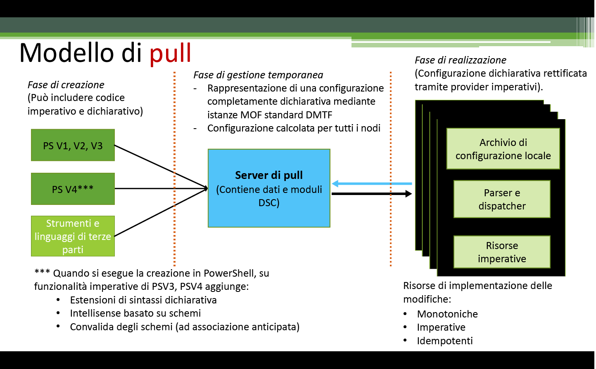

# Applicazione delle configurazioni

>Si applica a: Windows PowerShell 4.0, Windows PowerShell 5.0

Ci sono due modi per applicare le configurazioni di PowerShell DSC (Desired State Configuration): la modalità push e la modalità pull.

## Modalità push

La modalità push fa riferimento a un utente che applica attivamente una configurazione in un nodo di destinazione chiamando il cmdlet [Start-DscConfiguration](https://technet.microsoft.com/en-us/library/dn521623.aspx).

Dopo la creazione e la compilazione di una configurazione, è possibile applicarla in modalità push chiamando il cmdlet [Start-DscConfiguration](https://technet.microsoft.com/en-us/library/dn521623.aspx), impostando il parametro -Path del cmdlet sul percorso in cui si trova il file MOF di configurazione. Se, ad esempio, il file MOF di configurazione si trova in `C:\DSC\Configurations\localhost.mof`, per applicarlo al computer locale usare il comando seguente: `Start-DscConfiguration -Path 'C:\DSC\Configurations'`

> __Nota__: per impostazione predefinita, DSC esegue una configurazione come processo in background. Per eseguire la configurazione in modo interattivo, chiamare [Start-DscConfiguration](https://technet.microsoft.com/en-us/library/dn521623.aspx) con il parametro __-Wait__.

## Modalità pull

In modalità pull, i client di pull sono configurati per ottenere le relative configurazioni DSC da un server di pull remoto. Analogamente, il server di pull è stato configurato per ospitare il servizio DSC e ne è stato effettuato il provisioning con le configurazioni e le risorse necessarie per i client di pull. Ogni client di pull ha un'attività pianificata che esegue un controllo di conformità periodico sulla configurazione del nodo. Quando l'evento viene generato per la prima volta, Gestione configurazione locale nel client di pull convalida la configurazione. Se il client di pull è configurato come desiderato, non accade nulla. In caso contrario, Gestione configurazione locale invia una richiesta al server di pull per ottenere una determinata configurazione. Se tale configurazione è disponibile nel server di pull e supera i controlli di convalida iniziali, viene trasmessa al client di pull, dove viene quindi eseguita da Gestione configurazione locale.

Per altre informazioni sulla distribuzione di un server di pull DSC in locale, vedere la guida alla pianificazione e configurazione di server di pull DSC.

Se si preferisce usare un servizio online per ospitare la funzionalità del server di pull, vedere il servizio [Automation DSC per Azure](https://azure.microsoft.com/en-us/documentation/articles/automation-dsc-overview/).

Gli argomenti seguenti illustrano come configurare i client e i server di pull:

- [Configurazione di un server di pull Web](pullServer.md)
- [Configurazione di un server di pull SMB](pullServerSMB.md)
- [Configurazione di un client di pull](pullClientConfigID.md)

<!--HONumber=Aug16_HO3-->

