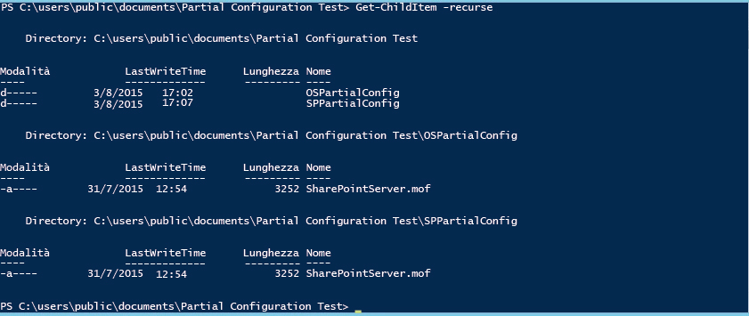
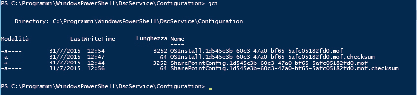

# Configurazioni parziali di PowerShell DSC (Desired State Configuration)

>Si applica a: Windows PowerShell 5.0

In PowerShell 5.0, DSC (Desired State Configuration) consente di distribuire le configurazioni in frammenti e da più origini. Gestione configurazione locale nel nodo di destinazione riunisce i frammenti prima di applicarli come singola configurazione. Questa funzionalità consente di condividere il controllo della configurazione tra team o singoli utenti. Ad esempio, se due o più team di sviluppatori collaborano a un servizio, ogni team potrebbe voler creare configurazioni per gestire la propria parte del servizio. È possibile effettuare il pull di ognuna di queste configurazioni da server di pull diversi e aggiungere le configurazioni in fasi diverse del processo di sviluppo. Le configurazioni parziali consentono inoltre a persone o team diversi di controllare aspetti diversi della configurazione dei nodi senza la necessità di coordinare le modifiche di un singolo documento di configurazione. Un team, ad esempio, potrebbe essere responsabile della distribuzione di una VM e un sistema operativo, mentre un altro team potrebbe distribuire altri servizi e applicazioni in tale VM. Con le configurazioni parziali, ogni team può creare la sua configurazione, senza che alcuna di esse sia inutilmente complessa.

È possibile usare le configurazioni parziali in modalità push o pull o in una combinazione delle due modalità.

## Configurazioni parziali in modalità push
Per usare le configurazioni parziali in modalità push, è necessario configurare Gestione configurazione locale nel nodo di destinazione per ricevere le configurazioni parziali. Il push di ogni configurazione parziale nella destinazione viene effettuato usando il cmdlet Publish-DSCConfiguration. Il nodo di destinazione combina quindi la configurazione parziale in una singola configurazione, che è possibile applicare chiamando il cmdlet [Start-DscConfiguration](https://technet.microsoft.com/en-us/library/dn521623.aspx).

### Configurazione di Gestione configurazione locale per le configurazioni parziali in modalità push
Per configurare Gestione configurazione locale per le configurazioni parziali in modalità push, è necessario creare una configurazione **DSCLocalConfigurationManager** con un blocco **PartialConfiguration** per ogni configurazione parziale. Per altre informazioni sulla configurazione di Gestione configurazione locale, vedere [Configurazione di Gestione configurazione locale](https://technet.microsoft.com/en-us/library/mt421188.aspx). L'esempio seguente illustra una configurazione di Gestione configurazione locale che prevede due configurazioni parziali, una che distribuisce il sistema operativo e una che distribuisce e configura SharePoint.

```powershell
[DSCLocalConfigurationManager()]
configuration PartialConfigDemo
{
    Node localhost
    {
        
           PartialConfiguration OSInstall
        {
            Description = 'Configuration for the Base OS'
            RefreshMode = 'Push'
        }
           PartialConfiguration SharePointConfig
        {
            Description = 'Configuration for the SharePoint server'
            RefreshMode = 'Push'
        }
    }
}
PartialConfigDemo 
```

Il valore di **RefreshMode** per ogni configurazione parziale è "Push". I nomi dei blocchi **PartialConfiguration** (in questo caso, "OSInstall" e "SharePointConfig") devono corrispondere esattamente ai nomi delle configurazioni di cui viene effettuato il push nel nodo di destinazione.

### Pubblicazione e avvio di configurazioni parziali in modalità push


Chiamare quindi **Publish-DSCConfiguration** per ogni configurazione, passando le cartelle che contengono i documenti di configurazione come parametri Path. Dopo la pubblicazione di entrambe le configurazioni, è possibile chiamare `Start-DSCConfiguration –UseExisting` nel nodo di destinazione.

## Configurazioni parziali in modalità pull

È possibile effettuare il pull delle configurazioni parziali da uno o più server di pull. Per altre informazioni sui server di pull, vedere [Server di pull Windows PowerShell DSC (Desired Configuration Pull)](pullServer.md). A tale scopo, è necessario configurare Gestione configurazione locale nel nodo di destinazione per effettuare il pull delle configurazioni parziali, nonché assegnare un nome ai documenti di configurazione e posizionarli in modo appropriato nei server di pull.

### Configurazione di Gestione configurazione locale per le configurazioni dei nodi di pull

Per configurare Gestione configurazione locale per il pull di configurazioni parziali da un server di pull, è necessario definire il server di pull in un blocco **ConfigurationRepositoryWeb** (per un server di pull HTTP) o **ConfigurationRepositoryShare** (per un server di pull SMB). Creare quindi blocchi **PartialConfiguration** che fanno riferimento al server di pull usando la proprietà **ConfigurationSource**. È anche necessario creare un blocco Settings per specificare che Gestione configurazione locale usa la modalità pull, nonché specificare il valore di ConfigurationID usato dal server di pull e dal nodo di destinazione per identificare le configurazioni. La metaconfigurazione seguente definisce un server di pull HTTP denominato CONTOSO-PullSrv e due configurazioni parziali che usano tale server di pull.

```powershell
[DSCLocalConfigurationManager()]
configuration PartialConfigDemo
{
    Node localhost
    {
        Settings
        {
            RefreshMode = 'Pull'
            ConfigurationID = '1d545e3b-60c3-47a0-bf65-5afc05182fd0'
            RefreshFrequencyMins = 30 
            RebootNodeIfNeeded = $true
        }
        ConfigurationRepositoryWeb CONTOSO-PullSrv
        {
            ServerURL = 'https://CONTOSO-PullSrv:8080/PSDSCPullServer.svc'
            
        }
        
           PartialConfiguration OSInstall
        {
            Description = 'Configuration for the Base OS'
            ConfigurationSource = '[ConfigurationRepositoryWeb]CONTOSO-PullSrv'
            RefreshMode = 'Pull'
        }
           PartialConfiguration SharePointConfig
        {
            Description = 'Configuration for the Sharepoint Server'
            ConfigurationSource = '[ConfigurationRepositoryWeb]CONTOSO-PullSrv'
            DependsOn = [PartialConfiguration]OSInstall
            RefreshMode = 'Pull'
        }
    }
}
PartialConfigDemo 
```

È possibile effettuare il pull delle configurazioni parziali da più di un server di pull. A tale scopo, è sufficiente definire ogni server di pull e quindi fare riferimento al server di pull appropriato in ogni blocco PartialConfiguration.

Dopo aver creato la metaconfigurazione, è necessario eseguirla per creare un documento di configurazione (un file MOF) e quindi chiamare [Set-DscLocalConfigurationManager](https://technet.microsoft.com/en-us/library/dn521621(v=wps.630).aspx) per configurare Gestione configurazione locale.

### Assegnazione dei nomi ai documenti di configurazione e posizionamento nei server di pull

I documenti di configurazione parziale devono essere inseriti nella cartella specificata come **ConfigurationPath** nel file `web.config` per il server di pull (in genere `C:\Program Files\WindowsPowerShell\DscService\Configuration`). I documenti di configurazione devono essere denominati come segue: _ConfigurationName_. _ConfigurationID_`.mof`, dove _ConfigurationName_ è il nome della configurazione parziale e _ConfigurationID_ è l'ID della configurazione definita in Gestione configurazione locale nel nodo di destinazione. Per questo esempio, i nomi dei documenti di configurazione devono essere quelli indicati di seguito.


### Esecuzione di configurazioni parziali da un server di pull

Dopo aver configurato Gestione configurazione locale nel nodo di destinazione e dopo aver creato i documenti di configurazione e aver assegnato loro i nomi appropriati nel server di pull, il nodo di destinazione effettuerà il pull delle configurazioni parziali, le combinerà e applicherà la configurazione risultante a intervalli regolari, come specificato dalla proprietà **RefreshFrequencyMins** di Gestione configurazione locale. Se si vuole forzare un aggiornamento, è possibile chiamare il cmdlet Update-DscConfiguration per effettuare il pull delle configurazioni e quindi `Start-DSCConfiguration –UseExisting` per applicare la configurazione.

## Configurazioni parziali in modalità mista push e pull

È anche possibile combinare le modalità push e pull per le configurazioni parziali. In altre parole, è possibile usare una configurazione parziale di cui viene effettuato il pull da un server di pull e un'altra configurazione parziale di cui viene effettuato il push. Ogni configurazione parziale viene trattata in base alla relativa modalità di aggiornamento, come descritto nelle sezioni precedenti. Ad esempio, la metaconfigurazione seguente descrive lo stesso esempio, con la configurazione parziale del sistema operativo in modalità pull e la configurazione parziale di SharePoint in modalità push.

```powershell
[DSCLocalConfigurationManager()]
configuration PartialConfigDemo
{
    Node localhost
    {
        Settings
        {
            RefreshMode = 'Pull'
            ConfigurationID = '1d545e3b-60c3-47a0-bf65-5afc05182fd0'
            RefreshFrequencyMins = 30 
            RebootNodeIfNeeded = $true
        }
        ConfigurationRepositoryWeb CONTOSO-PullSrv
        {
            ServerURL = 'https://CONTOSO-PullSrv:8080/PSDSCPullServer.svc'
            
        }
        
           PartialConfiguration OSInstall
        {
            Description = 'Configuration for the Base OS'
            ConfigurationSource = '[ConfigurationRepositoryWeb]CONTOSO-PullSrv'
            RefreshMode = 'Pull'
        }
           PartialConfiguration SharePointConfig
        {
            Description = 'Configuration for the Sharepoint Server'
            DependsOn = [PartialConfiguration]OSInstall
            RefreshMode = 'Push'
        }
    }
}
PartialConfigDemo 
```

Si noti che il valore di **RefreshMode** specificato nel blocco Settings è "Pull", mentre il valore di **RefreshMode** per la configurazione parziale OSInstall è "Push".

Assegnare i nomi ai documenti di configurazione e posizionare i documenti come descritto in precedenza per le relative modalità di aggiornamento. Chiamare **Publish-DSCConfiguration** per pubblicare la configurazione parziale di SharePointInstall e attendere il pull della configurazione OSInstall dal server di pull oppure forzare un aggiornamento chiamando [Update-DscConfiguration](https://technet.microsoft.com/en-us/library/mt143541(v=wps.630).aspx).

##Vedere anche 

**Concetti**
[Server di pull Windows PowerShell DSC (Desired Configuration Pull)](pullServer.md) 
[Configurazione di Gestione configurazione locale](https://technet.microsoft.com/en-us/library/mt421188.aspx) 


<!--HONumber=Mar16_HO4-->


