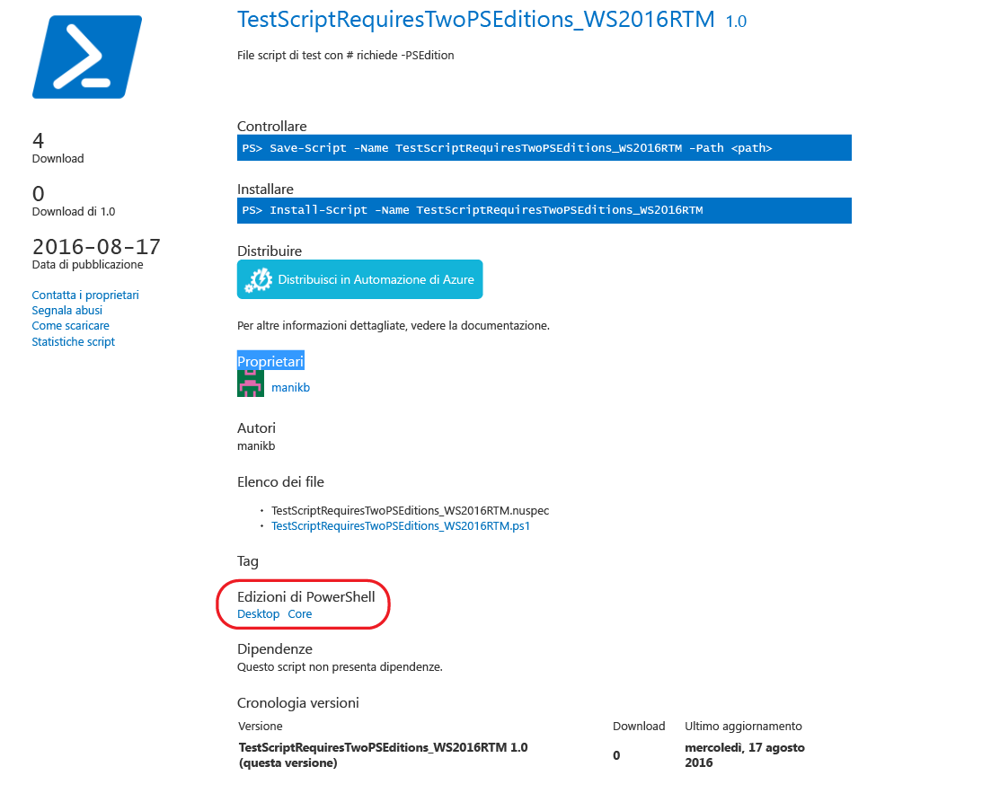

# Elementi con versioni di PowerShell compatibili

A partire dalla versione 5.1, PowerShell è disponibile in diverse edizioni che indicano vari set di funzionalità e compatibilità della piattaforma.

- **Desktop Edition:** è basata su .NET Framework e fornisce compatibilità con script e moduli destinati a versioni di PowerShell che eseguono edizioni footprint complete di Windows, ad esempio Server Core e Windows Desktop.
- **Core Edition:** è basata su .NET Core e fornisce compatibilità con script e moduli destinati a versioni di PowerShell che eseguono edizioni footprint ridotte di Windows, ad esempio Nano Server e Windows IoT.

## PowerShell Gallery estrae i metadati PSEditions supportati e consente di filtrare gli elementi compatibili per specifiche le edizioni di PowerShell

Se per un elemento è specificato un valore PSEditions compatibile, verrà elencato come parte di "Edizioni di PowerShell" nella pagina di visualizzazione dell'elemento e anche nei risultati degli elementi.

## Cercare elementi compatibili con PowerShellCore nell'interfaccia utente della raccolta

Usare Tags:"PSEdition_Desktop" e Tags:"PSEdition_Core" per filtrare gli elementi in PowerShell Gallery.

### Usare Tags:"PSEdition_Core" per cercare elementi compatibili con l'edizione Core di PowerShell.

### Usare Tags:"PSEdition_Desktop" per cercare elementi compatibili con l'edizione Desktop di PowerShell.

## Altre informazioni sulla creazione e la ricerca di elementi con versioni di PowerShell compatibili

- [Moduli con edizioni di PS](../../concepts/module-psedition-support.md)
- [Script con PSEditions](../../concepts/script-psedition-support.md)