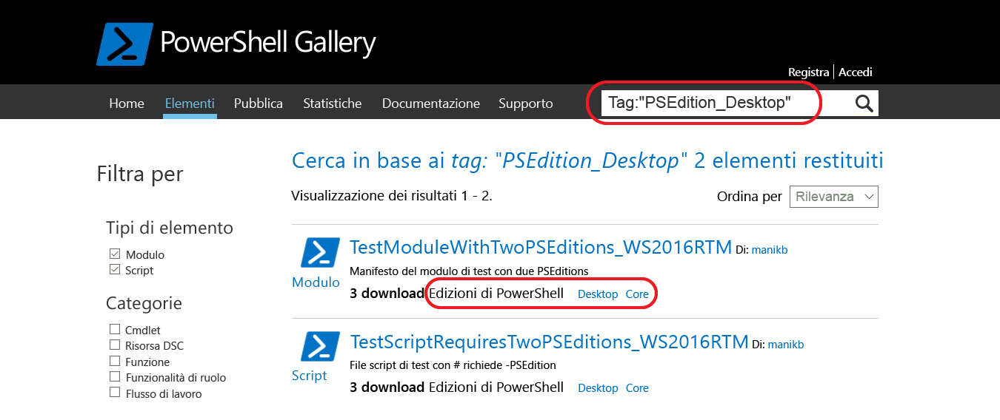

# Elementi con versioni di PowerShell compatibiliItems with compatible PowerShell Editions
A partire dalla versione 5.1, PowerShell è disponibile in diverse edizioni che indicano vari set di funzionalità e compatibilità della piattaforma.Starting with version 5.1, PowerShell is available in different editions which denote varying feature sets and platform compatibility.

- **Desktop Edition:** è basata su .NET Framework e fornisce compatibilità con script e moduli destinati a versioni di PowerShell che eseguono edizioni footprint complete di Windows, ad esempio Server Core e Windows Desktop.**Desktop Edition:** Built on .NET Framework and provides compatibility with scripts and modules targeting versions of PowerShell running on full footprint editions of Windows such as Server Core and Windows Desktop.
- **Core Edition:** è basata su .NET Core e fornisce compatibilità con script e moduli destinati a versioni di PowerShell che eseguono edizioni footprint ridotte di Windows, ad esempio Nano Server e Windows IoT.**Core Edition:** Built on .NET Core and provides compatibility with scripts and modules targeting versions of PowerShell running on reduced footprint editions of Windows such as Nano Server and Windows IoT.

## PowerShell Gallery estrae i metadati PSEditions supportati e consente di filtrare gli elementi compatibili per specifiche le edizioni di PowerShellPowerShell Gallery extracts supported PSEditions metadata and allows you to filters the items compatible for specific PowerShell Editions

Se per un elemento è specificato un valore PSEditions compatibile, verrà elencato come parte di "Edizioni di PowerShell" nella pagina di visualizzazione dell'elemento e anche nei risultati degli elementi.If an item has compatible PSEditions specified, they will be listed as part of 'PowerShell Editions' in the item display page and also in items results.

## Cercare elementi compatibili con PowerShellCore nell'interfaccia utente della raccoltaSearch for items in the gallery UI which works on PowerShellCore
Usare Tags:"PSEdition_Desktop" e Tags:"PSEdition_Core" per filtrare gli elementi in PowerShell Gallery.Use Tags:"PSEdition_Desktop" and Tags:"PSEdition_Core" to filters the items on PowerShell Gallery.

### Usare Tags:"PSEdition_Core" per cercare elementi compatibili con l'edizione Core di PowerShell.Use Tags:"PSEdition_Core" to search items compatible with PowerShell Core Edition.

### Usare Tags:"PSEdition_Desktop" per cercare elementi compatibili con l'edizione Desktop di PowerShell.Use Tags:"PSEdition_Desktop" to search items compatible with PowerShell Desktop Edition.

## Altre informazioni sulla creazione e la ricerca di elementi con versioni di PowerShell compatibiliMore details on authoring and finding the items with compatible PowerShell Editions
### [Moduli con edizioni di PSModules with PSEditions](../psget/module/modulewithpseditionsupport.md)
### [Script con PSEditionsScripts with PSEditions](../psget/script/scriptwithpseditionsupport.md)

