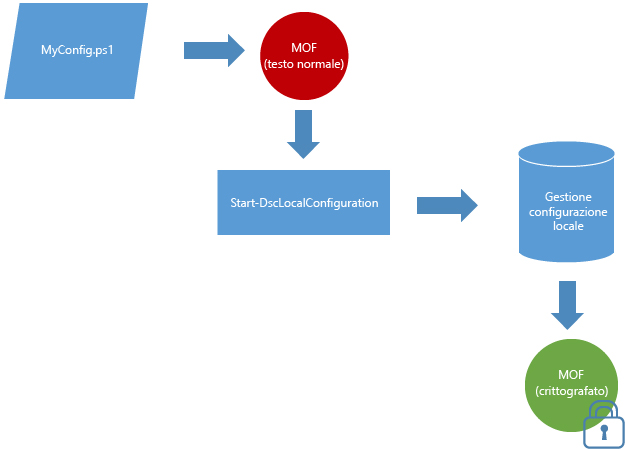

# I documenti MOF vengono crittografati per impostazione predefinita

I documenti di configurazione contengono informazioni riservate. Nelle versioni precedenti di DSC era necessario distribuire e gestire certificati per proteggere le credenziali all'interno di una configurazione. Per molti, questo requisito rappresentava un carico oneroso per la gestione e anche con tutto il lavoro richiesto per eseguire questa operazione, comunque rimanevano informazioni della configurazione non protette o impossibili da proteggere.

Il problema non sussiste più, perché **tutti i file MOF di configurazione sono protetti per impostazione predefinita**. Non sono necessari certificati o impostazioni di metaconfigurazione. Ogni volta che un file di configurazione MOF viene salvato su disco da Gestione configurazione locale in un nodo di destinazione, viene crittografato. I file MOF vengono crittografati con [DPAPI](https://msdn.microsoft.com/library/ms995355.aspx). **Nota:** i file MOF generati da uno script di configurazione non vengono crittografati.

**Esempio:** Crittografia in modalità push 

Se si usa già il metodo basato su certificati per crittografare le password o se è necessaria ulteriore protezione per le password, il [metodo esistente di crittografia basata su certificati](https://msdn.microsoft.com/powershell/dsc/securemof) continuerà a funzionare. Il risultato sarà un documento MOF completamente crittografato tramite DPAPI e con password crittografate al suo interno.

La crittografia si applica solo ai documenti MOF di configurazione (pending.mof, current.mof, previous.mof e file MOF parziali). I file MOF di metaconfigurazione vengono ancora salvati in formato testo normale perché è meno probabile che contengano informazioni riservate.