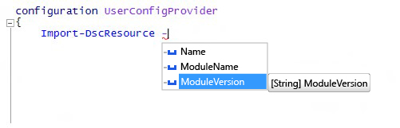

# <a name="import-dscresource-keyword-supports--moduleversion-parameter"></a>La parola chiave Import-DscResource supporta il parametro -ModuleVersion

È stato aggiunto un nuovo parametro alla parola chiave dinamica `Import-DscResource`, disponibile durante la creazione di configurazioni DSC. Gli autori di configurazioni possono ora specificare la versione del modulo esatta da cui caricare le risorse DSC. La nuova sintassi della parola chiave è:

```powershell
Import-DscResource [-Name <ResourceName(s)>] [-ModuleName <ModuleName(s)>] [-ModuleVersion <ModuleVersion>]
```

* **Name**: nome di una o più risorse da importare.
* **ModuleName**: nomi dei moduli o oggetti ModuleSpecification di uno o più moduli da importare.
* **ModuleVersion**: versione del modulo da importare. Se usato, ModuleName deve rappresentare un solo modulo in base al nome.

In Windows PowerShell ISE, viene visualizzato con IntelliSense:



**Nota**: il parametro `–ModuleVersion` può essere usato solo in combinazione con il parametro `–ModuleName`. Non può essere usato con i nomi di risorse usando solo il parametro `–Name`.

In precedenza, l'unico modo per specificare la versione del modulo durante il caricamento delle risorse DSC era tramite l'oggetto di specifica del modulo, ad esempio: `–ModuleName @{ModuleName="UserConfigProvider";ModuleVersion="3.0"}`
