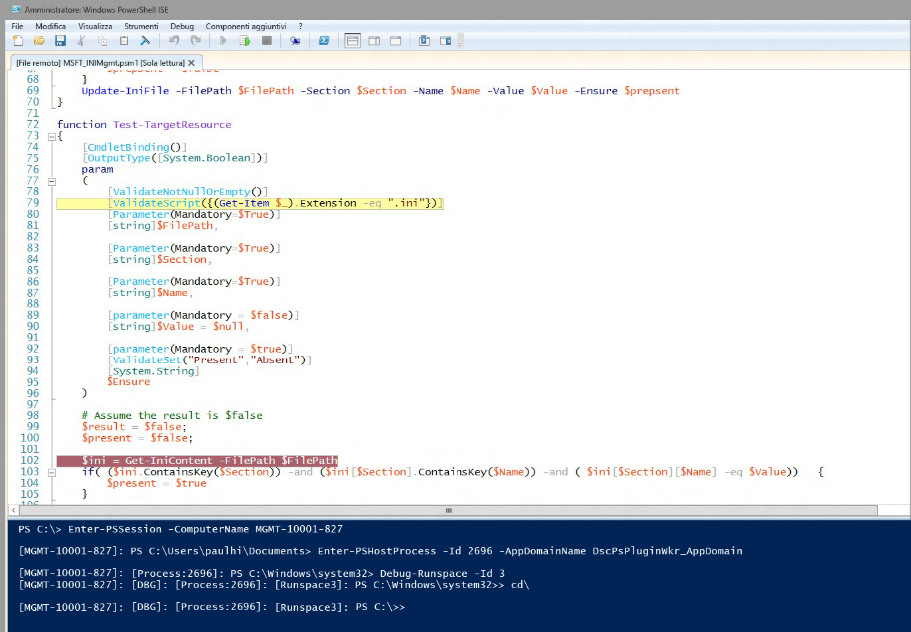

# Debug degli script per risorse DSC
WMF 5.0 Production Preview include il supporto del debug degli script per le risorse DSC durante l'esecuzione nei nodi di destinazione. Nelle versioni precedenti di WMF 5.0 sono state aggiunte funzionalità avanzate di debug degli script con la possibilità di collegare il debugger a processi locali (Get-PSHostProcessInfo, Enter-PSHostProcessInfo, Exit-PSHostProcessInfo), enumerare tutti gli spazi di esecuzione in un processo ed eseguire il debug di uno spazio di esecuzione arbitrario in un processo (Get-Runspace, Debug-Runspace).

Le funzionalità di debug degli script per le risorse DSC estendono queste caratteristiche con l'aggiunta di due nuovi cmdlet.

##Sintassi
**Enable-DscDebug**
Enable-DscDebug \[-BreakAll\] \[-CimSession &lt;SessioneCim\[\]&gt;\] \[-ThrottleLimit &lt;int&gt;\] \[-AsJob\] \[-WhatIf\] \[-Confirm\] \[&lt;ParametriComuni&gt;\]

**Disable-DscDebug**
Disable-DscDebug \[-CimSession &lt;SessioneCim\[\]&gt;\] \[-ThrottleLimit &lt;int&gt;\] \[-AsJob\] \[-WhatIf\] \[-Confirm\] \[&lt;ParametriComuni&gt;\]

##Flusso di lavoro tipico


```PowerShell
PS C:\Test> Enable-DscDebug –BreakAll

PS C:\Test> Start-DscConfiguration -path .\TestConfig2 -Wait -Verbose
VERBOSE: Perform operation 'Invoke CimMethod' with following parameters, ''namespaceName' = root/Microsoft/Windows/DesiredStateConfiguration,'className' = MSFT\_DSCLocalConfigurationManager,'methodName' = SendConfigurationApply'.
VERBOSE: An LCM method call arrived from computer MGMT-10001-827 with user sid S-1-5-21-397955417-626881126-188441444-3860663.
VERBOSE: [MGMT-10001-827]: LCM: [ Start Set ]
WARNING: [MGMT-10001-827]: [DSCEngine] Warning LCM is in Debug 'ResourceScriptBreakAll' mode. Resource script processing will be stopped to wait for PowerShell script debugger to attach.
VERBOSE: [MGMT-10001-827]: [DSCEngine] Importing the module C:\WINDOWS\system32\WindowsPowerShell\v1.0\Modules\PSDesiredStateConfiguration\DscResources\MSFT_EnvironmentResource\MSFT_EnvironmentResource.psm1 in force mode.
VERBOSE: [MGMT-10001-827]: LCM: [ Start Resource ] [[Environment]e1]
VERBOSE: [MGMT-10001-827]: LCM: [ Start Test ] [[Environment]e1]
VERBOSE: [MGMT-10001-827]: [[Environment]e1] Importing the module MSFT_EnvironmentResource in force mode.
WARNING: [MGMT-10001-827]: [[Environment]e1] Resource is waiting for PowerShell script debugger to attach. Use the following commands to begin debugging this resource script:
Enter-PSSession -ComputerName MGMT-10001-827 -Credential <credentials>
Enter-PSHostProcess -Id 2640 -AppDomainName DscPsPluginWkr_AppDomain
Debug-Runspace -Id 3

PS C:\Test> Disable-DscDebug
```
Di seguito verranno descritti i singoli comandi e le relative funzionalità:

**Enable-DscDebug -BreakAll**
Il cmdlet Enable-DscDebug con BreakAll consente di configurare Gestione configurazione locale DSC per l'esecuzione di script Get-TargetResource, Set-TargetResource e Test-TargetResource in modalità Interrompi tutto. In questa modalità, lo script si interrompe alla prima istruzione e aspetta che venga associato un debugger. È quindi possibile connettersi al computer di destinazione tramite comunicazione remota di Windows PowerShell e collegare il debugger di Windows PowerShell al processo e allo spazio di esecuzione di Gestione configurazione locale per eseguire il debug dello script. È in seguito possibile impostare i punti di interruzione ed eseguire il debug dello script con le normali procedure di Windows PowerShell.

**Start-DscConfiguration -path .\TestConfig2 -Wait -Verbose**

Questo comando avvia DSC ma, come indicato in precedenza, dato che per il nodo di destinazione è abilitata la modalità di debug, il comando verrà interrotto in corrispondenza della prima risorsa DSC eseguita da Gestione configurazione locale.

Per iniziare la sessione di debug ed eseguire i comandi visualizzati nel messaggio di avviso dopo l'esecuzione di Start-DscConfiguration, è necessario collegare il debugger degli script di Windows PowerShell client al computer, processo, dominio di applicazione e spazio di esecuzione appropriati.

* Eseguire questo comando per usare facoltativamente la comunicazione remota di Windows PowerShell per connettersi al computer di destinazione. Ignorare questo passaggio se è già disponibile una connessione desktop remoto.
```PowerShell
Enter-PSSession -ComputerName MGMT-10001-827
```
* Questo comando viene collegato al processo host di Gestione configurazione locale DSC e al dominio dell'applicazione in cui viene eseguito lo script di risorsa.
```PowerShell
Enter-PSHostProcess -Id 2640 -AppDomainName DscPsPluginWkr\_AppDomain
```
*  Quest'ultimo comando consente di eseguire il debug dello spazio di esecuzione DSC che esegue lo script.
```PowerShell
Debug-Runspace -Id 3
```


Dopo aver collegato il debugger, impostare punti di interruzione nelle righe in cui si vuole analizzare l'esecuzione dello script ed eseguire il comando **continue** del debugger per consentire l'esecuzione dello script nel debugger. Al termine del debug, è possibile interrompere l'esecuzione dello script digitando il comando del debugger **quit** o proseguire l'esecuzione dello script senza debugger eseguendo il comando del debugger **detach**.

Si noti che ***tutti*** gli script di risorsa vengono arrestati nel debugger. Questo significa che gli script Test-TargetResoruce, Set-TargetResource e Get-TargetResource vengono interrotti uno alla volta nel debugger. Se non si vuole eseguire il debug di uno script di risorsa, è possibile uscire dalla modalità di debug nello spazio di esecuzione eseguendo questo comando.

Disable-RunspaceDebug -RunspaceId 3

Oppure è possibile associare il debugger eseguendo Debug-Runspace e poi eseguire immediatamente il comando **detach**.

Dopo aver completato il debug dello script di risorsa, è necessario arrestare la configurazione DSC eseguendo il comando seguente.

Stop-DscConfiguration -Force

Infine, è necessario riconfigurare Gestione configurazione locale nel computer di destinazione per disabilitare la modalità di debug con il cmdlet Disable-DscDebug.<!--HONumber=Mar16_HO2-->
